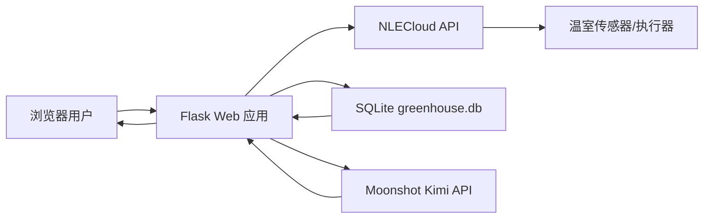

# 智慧温室监测与 AI 控制系统

一个基于 Flask、SQLite、NLECloud 和 Moonshot Kimi API 构建的智慧温室管理系统。系统能够采集温室环境数据、保存历史记录、统计与可视化温度变化、控制执行器，并允许用户通过自然语言让 AI 分析数据或执行受控操作。

## 目录

- [项目简介](#项目简介)
- [核心功能](#核心功能)
- [系统架构](#系统架构)
- [项目结构](#项目结构)
- [环境要求](#环境要求)
- [安装与运行](#安装与运行)
- [系统使用流程](#系统使用流程)
- [页面说明](#页面说明)
- [传感器与设备配置](#传感器与设备配置)
- [数据库设计](#数据库设计)
- [数据库查看方法](#数据库查看方法)
- [数据采集与统计逻辑](#数据采集与统计逻辑)
- [AI 助手](#ai-助手)
- [接口说明](#接口说明)
- [安全与校验](#安全与校验)
- [作业任务完成情况](#作业任务完成情况)
- [常见问题](#常见问题)

## 项目简介

本系统面向智慧农业温室场景。用户登录并完成 NLECloud 授权后，前端会每 5 秒请求一次传感器接口。后端从云平台读取当前选中设备的温度、湿度、光照、大气压力、二氧化碳、风速等数据，并在默认温室设备上将有效数据写入 SQLite 数据库，再由首页展示实时状态、历史列表、统计结果和趋势图。

系统同时集成 Kimi AI 助手。AI 会跟随页面当前选中的设备进行分析和控制，可以读取当前设备实时数据、参考最近的数据库历史记录进行连续对话，也可以把自然语言控制意图转换成受限的设备动作，例如设置第一台设备的温度上下限，或控制当前设备白名单内的执行器开关。

## 核心功能

### 账号管理

- 11 位数字账号登录
- 新账号注册
- 姓名、学号、密码和头像维护
- 账号资料持久化到 SQLite
- 默认账号自动写入数据库

### 云平台与传感器

- NLECloud 账号授权
- AccessToken 保存在当前登录会话
- 支持两台 NLECloud 设备切换查看
- 自动读取当前设备传感器数据
- 页面每 5 秒自动刷新
- 手动刷新传感器数据
- 云平台异常、设备离线和数据错误提示

### 历史数据

- 每次成功采集后写入数据库
- 历史数据在后端重启后仍然保留
- 页面展示最近 10 条记录
- 历史列表最新记录排在最上方
- 数据库查看页最多展示最近 200 条记录

### 统计与可视化

- 温度数据总条数
- 最高温度
- 最低温度
- 平均温度
- 最近温度趋势折线图
- 最新点、变化方向和时间标记

### 执行器控制

- 按当前设备打开或关闭执行器
- 向 NLECloud 发送设备命令
- 第一台默认设备的执行器操作成功后保存状态
- 第二台网关设备支持风扇、雾化器、水泵、补光灯控制

### AI 温室助手

- 使用 `kimi-k2.6`
- 默认关闭思考模式，提高普通对话响应速度
- 支持多轮上下文对话
- 跟随首页当前设备切换分析对象
- 读取当前设备实时数据，并参考最近历史记录进行分析
- 支持明确控制指令
- 支持模糊自然语言控制意图
- 后端重启后自动开始新的 AI 会话

### 创新功能：智能预警

系统根据最近温度、上下限和短期变化自动判断：

- 高温超限
- 低温超限
- 升温较快
- 降温较快
- 状态平稳

## 系统架构



### 数据流

1. 浏览器每 5 秒请求 `/api/sensors`。
2. Flask 使用当前会话中的 NLECloud AccessToken 请求云平台。
3. 后端整理传感器结果并写入 `temperature_records`。
4. 后端记录最近已知的执行器状态。
5. 浏览器请求 `/api/history`。
6. Flask 从 SQLite 查询历史数据并计算统计结果。
7. 前端更新数据卡片、历史表格、统计卡片和趋势图。

### AI 指令流

1. 用户在 AI 面板输入自然语言。
2. 明确控制语句优先由后端规则解析。
3. 模糊语句由 Kimi 转换为受限 JSON 动作。
4. 后端只接受白名单动作。
5. 后端校验阈值范围和云平台授权。
6. 校验通过后调用 NLECloud 执行。
7. 执行结果作为助手回复返回，并进入连续对话上下文。

## 技术栈

| 分类 | 技术 |
| --- | --- |
| 后端 | Python、Flask |
| 前端 | HTML、CSS、原生 JavaScript、Jinja2 |
| 数据库 | SQLite 3 |
| 设备云平台 | NLECloud |
| AI 服务 | Moonshot Kimi API |
| 网络请求 | Python `urllib.request` |
| 会话管理 | Flask Session |

## 项目结构

```text
D:\web
├── app.py                    # Flask 主程序、接口、数据库和 AI 逻辑
├── greenhouse.db             # SQLite 数据库，首次运行自动创建
├── README.md                 # 项目文档
├── .env                      # 本地环境变量，不应公开
├── .gitignore
├── static
│   └── uploads               # 用户上传的头像
└── templates
    ├── base.html             # 登录后的公共页面结构
    ├── login.html            # 登录页
    ├── register.html         # 注册页
    ├── home.html             # 监测首页、历史图表、AI 助手
    ├── profile.html          # 个人资料页
    ├── cloud_login.html      # NLECloud 授权页
    ├── hardware.html         # 硬件和执行器页面
    ├── strategy.html         # 策略页面
    └── database.html         # 浏览器数据库查看页
```

## 环境要求

- Windows 10/11
- Python 3.10 或更高版本
- 可访问 NLECloud API
- 可访问 Moonshot API
- 有效的 Moonshot API Key
- 有效的 NLECloud 账号

项目主要依赖 Flask：

```powershell
pip install flask
```

如果使用项目已有虚拟环境，可直接激活：

```powershell
cd D:\web
.\.venv\Scripts\Activate.ps1
```

## 安装与运行

### 1. 进入项目目录

```powershell
cd D:\web
```

### 2. 创建虚拟环境（可选）

```powershell
python -m venv .venv
.\.venv\Scripts\Activate.ps1
```

### 3. 安装依赖

```powershell
pip install flask
```

### 4. 配置环境变量

在项目根目录创建 `.env`：

```env
MOONSHOT_API_KEY=你的_Moonshot_API_Key
KIMI_MODEL=kimi-k2.6
MOONSHOT_API_BASE=https://api.moonshot.cn/v1
```

说明：

- `MOONSHOT_API_KEY`：必填，用于 AI 助手。
- `KIMI_MODEL`：可选，默认值为 `kimi-k2.6`。
- `MOONSHOT_API_BASE`：可选，默认值为 `https://api.moonshot.cn/v1`。

不要把真实 API Key 写入 README，也不要把 `.env` 提交到公开仓库。

### 5. 启动系统

```powershell
python app.py
```

启动后访问：

```text
http://127.0.0.1:5000
```

### 6. 默认账号

```text
账号：15600002034
密码：123456
```

默认账号会在数据库初始化时写入 `users` 表。

## 系统使用流程

1. 打开 `http://127.0.0.1:5000`。
2. 使用默认账号登录，或进入注册页添加账号。
3. 登录后进入“云平台授权”页面。
4. 输入 NLECloud 账号和密码完成授权。
5. 返回首页，系统开始每 5 秒采集数据。
6. 查看实时数据卡片、统计结果、趋势图和历史表格。
7. 在硬件页面控制执行器。
8. 打开 AI 温室助手进行数据问答或下达指令。
9. 访问 `/database` 查看数据库内容。

## 页面说明

### 登录页 `/`

- 校验 11 位数字账号
- 校验账号和密码
- 登录成功后写入 Flask Session

### 注册页 `/register`

- 添加新账号
- 校验两次密码
- 上传头像
- 同时更新内存缓存和 `users` 表

### 首页 `/home`

- 展示实时传感器数据
- 支持切换查看温室环境监测 `1516155` 和网关智慧农业 `1517154`
- 显示授权状态和更新时间
- 每 5 秒自动刷新
- 默认设备展示数据库统计结果、温度趋势和最新历史记录
- 第二台设备展示实时数据；历史统计仍以默认设备入库记录为准
- 提供 AI 助手，AI 会跟随当前选中的设备

### 云平台授权页 `/cloud-login`

- 登录 NLECloud
- 获取 AccessToken
- 将授权信息保存到当前 Session

### 硬件页 `/hardware`

- 支持切换查看两台设备
- 获取当前设备传感器状态
- 控制当前设备白名单内的执行器开关
- 默认设备 `1516155` 的 `actuator` 操作成功后写入 `actuator_status`

### 策略页 `/strategy`

- 展示温室数据和策略相关界面

### 个人资料页 `/profile`

- 修改姓名和学号
- 修改密码
- 更新头像
- 修改结果同步到 SQLite

### 数据库查看页 `/database`

登录后访问：

```text
http://127.0.0.1:5000/database
```

页面支持切换：

- 账号信息
- 温度历史
- 执行器状态

## 传感器与设备配置

默认入库设备 ID 在 `app.py` 中配置：

```python
NLE_DEVICE_ID = "1516155"
```

多设备配置集中在 `DEVICE_PROFILES` 中。页面切换设备时，前端会把 `device_id` 带到传感器、执行器和 AI 接口，后端再按当前设备读取数据或下发命令。

### 设备 `1516155`：温室环境监测

该设备是默认温室设备，也是当前写入 `temperature_records` 历史表的设备。

| 名称 | NLECloud API Tag | 单位 |
| --- | --- | --- |
| 当前温度 | `currentTemp` | ℃ |
| 上限温度 | `upperLimit` | ℃ |
| 下限温度 | `lowerLimit` | ℃ |
| 温度报警 | `alarm` | - |
| 大气压力 | `m_pressure` | hPa |
| 二氧化碳 | `m_co2` | ppm |
| 风速 | `m_wind_speed` | m/s |

执行器 Tag：

| 名称 | NLECloud API Tag |
| --- | --- |
| 设备 | `actuator` |

阈值命令 Tag：

```python
THRESHOLD_COMMANDS = {
    "upperLimit": "upperLimit",
    "lowerLimit": "lowerLimit",
}
```

### 设备 `1517154`：网关智慧农业

该设备用于首页和硬件页实时切换查看。当前版本只实时读取和控制，不写入默认历史统计表。

| 名称 | NLECloud API Tag | 单位 |
| --- | --- | --- |
| 温度 | `z_temperature` | ℃ |
| 湿度 | `z_humidity` | % |
| 光照 | `z_light` | Lux |
| 风速 | `m_wind_speed` | m/s |
| 水位 | `m_water_level` | cm |
| 水温 | `m_water_temperature` | ℃ |
| 大气压力 | `m_pressure` | hPa |
| 土壤温度 | `m_soil_temperature` | ℃ |
| 二氧化碳 | `m_co2` | ppm |
| 土壤湿度 | `m_soil_humidity` | % |

执行器 Tag：

| 名称 | NLECloud API Tag |
| --- | --- |
| 风扇 | `m_fan` |
| 雾化器 | `pvxnpvryauoa` |
| 水泵 | `kismqtzkhmfr` |
| 补光灯 | `vlngwhheuwmw` |

如果实际设备的 API Tag 不同，需要修改 `DEVICE_PROFILES` 中对应设备的传感器或执行器配置。

## 数据库设计

数据库路径：

```text
D:\web\greenhouse.db
```

应用启动时会自动执行建表逻辑，不需要手动创建数据库。

### `users` 账号信息表

| 字段 | 类型 | 约束/说明 |
| --- | --- | --- |
| `account` | TEXT | 主键，系统账号 |
| `password` | TEXT | 登录密码 |
| `name` | TEXT | 用户姓名 |
| `student_id` | TEXT | 学号 |
| `avatar` | TEXT | 头像 URL 或静态路径 |
| `created_at` | TEXT | 创建时间，默认当前时间 |

### `temperature_records` 温室历史表

| 字段 | 类型 | 说明 |
| --- | --- | --- |
| `id` | INTEGER | 自增主键 |
| `current_temp` | REAL | 当前温度 |
| `upper_limit` | REAL | 上限温度 |
| `lower_limit` | REAL | 下限温度 |
| `alarm` | REAL | 温度报警状态 |
| `pressure` | REAL | 大气压力 |
| `co2` | REAL | 二氧化碳浓度 |
| `wind_speed` | REAL | 风速 |
| `created_at` | TEXT | 采集时间 |

### `actuator_status` 执行器状态表

| 字段 | 类型 | 说明 |
| --- | --- | --- |
| `id` | INTEGER | 自增主键 |
| `name` | TEXT | 执行器名称 |
| `status` | INTEGER | `1` 开启，`0` 关闭 |
| `created_at` | TEXT | 记录时间 |

## 数据库查看方法

### 方法一：系统内置页面

推荐使用内置数据库页面，不需要安装 PyCharm 插件：

```text
http://127.0.0.1:5000/database
```

必须先登录系统。

### 方法二：Python 命令行

查看数据表：

```powershell
python -c "import sqlite3; c=sqlite3.connect('greenhouse.db'); print(c.execute(\"SELECT name FROM sqlite_master WHERE type='table'\").fetchall())"
```

查看最近温度：

```powershell
python -c "import sqlite3; c=sqlite3.connect('greenhouse.db'); print(c.execute('SELECT * FROM temperature_records ORDER BY id DESC LIMIT 10').fetchall())"
```

### 方法三：SQLite 图形工具

可以使用：

- DB Browser for SQLite
- PyCharm Professional 的 Database 工具
- VS Code SQLite Viewer

注意：`.db` 是二进制文件，不能用记事本直接打开。直接打开出现乱码不代表数据库损坏。

## 数据采集与统计逻辑

### 采集周期

首页 JavaScript 配置：

```javascript
const autoRefreshMs = 5000;
```

浏览器打开首页时立即采集一次，之后每 5 秒采集一次。

### 入库条件

- 至少有一项传感器值可以转换为数字时才写入。
- 无法获取的数据不会伪造为 `0`。
- 缺失字段在 SQLite 中保存为 `NULL`。

### 历史列表

- 后端从数据库按 ID 倒序查询最近 10 条。
- 返回前转换为时间正序，便于绘制趋势图。
- 前端表格再次倒序，保证最新记录显示在最上方。

### 统计方式

数据库使用以下聚合逻辑：

```sql
SELECT
    COUNT(current_temp),
    MAX(current_temp),
    MIN(current_temp),
    AVG(current_temp)
FROM temperature_records
WHERE current_temp IS NOT NULL;
```

因此无效温度和 `NULL` 不会影响统计结果。

## AI 助手

### 模型配置

默认模型：

```text
kimi-k2.6
```

系统关闭 K2.6 思考模式：

```json
{
  "thinking": {
    "type": "disabled"
  }
}
```

请求中不显式设置 `temperature`，避免 K2.6 参数校验错误。

### 连续对话

Kimi API 是无状态的，因此系统手动维护最近 12 条用户和助手消息。每次请求都会携带：

1. 系统提示词
2. 最近温室历史数据
3. 最近对话上下文
4. 当前用户问题

后端每次启动都会生成新的运行 ID。浏览器中旧的 AI Session 与新运行 ID 不匹配时，旧上下文会自动清空。

### 普通问答示例

```text
现在温室环境怎么样？
最近温度是上升还是下降？
CO2 浓度是否异常？
当前报警可能是什么原因？
请根据最近数据给出处理建议。
```

### 明确控制指令

```text
把上限调到 30，下限调到 20
温度阈值设置为 20 到 30
打开设备
关闭执行器
```

### 模糊控制指令

```text
太热了，帮我把阈值调合理一点
温度有点低，帮我优化一下
当前环境不稳定，帮我处理一下
```

模糊指令由 Kimi 转换为以下白名单 JSON：

```json
{"action":"set_thresholds","upper":30,"lower":20}
```

或：

```json
{"action":"device_switch","enabled":true}
```

普通聊天则应返回：

```json
{"action":"none"}
```

AI 只能提出动作，最终执行仍由后端完成。

## 接口说明

### 页面路由

| 方法 | 路径 | 说明 |
| --- | --- | --- |
| GET/POST | `/` | 登录 |
| GET/POST | `/register` | 注册 |
| GET | `/home` | 系统首页 |
| GET/POST | `/profile` | 个人资料 |
| GET/POST | `/cloud-login` | NLECloud 授权 |
| GET | `/hardware` | 硬件页面 |
| GET | `/strategy` | 策略页面 |
| GET | `/database` | 数据库查看页面 |

### JSON API

| 方法 | 路径 | 说明 |
| --- | --- | --- |
| GET | `/api/sensors?device_id=1516155` | 获取当前设备传感器数据；默认设备会写入历史表 |
| GET | `/api/history` | 获取历史、统计和预警 |
| POST | `/api/device-switch` | 控制当前设备执行器 |
| POST | `/api/thresholds` | 设置上下限 |
| GET | `/api/ai-advice?device_id=1516155` | 获取当前设备 AI 环境建议 |
| POST | `/api/ai-chat` | AI 对话与自然语言控制 |
| POST | `/api/ai-reset` | 清空 AI 对话上下文 |

### `/api/thresholds` 请求示例

```json
{
  "upperLimit": 30,
  "lowerLimit": 20
}
```

### `/api/device-switch` 请求示例

```json
{
  "device_id": "1517154",
  "api_tag": "pvxnpvryauoa",
  "enabled": true
}
```

### `/api/ai-chat` 请求示例

```json
{
  "device_id": "1517154",
  "message": "打开雾化器"
}
```

第一台设备也支持温度阈值控制：

```json
{
  "device_id": "1516155",
  "message": "把温度上限调到 30，下限调到 20"
}
```

## 安全与校验

当前系统包含以下保护：

- 未登录用户不能访问业务接口。
- 云平台命令必须有 AccessToken。
- 温度下限必须小于上限。
- 阈值范围限制为 `-40` 到 `100` ℃。
- AI 只能执行白名单动作。
- AI 返回的 JSON 会再次规范化和验证。
- 空的 AI 消息不会进入连续上下文。
- 重复 AI 请求使用线程锁控制。
- `.env` 已加入 `.gitignore`。

课程项目中密码当前以明文形式保存在 SQLite。生产系统应改用 Werkzeug 密码哈希：

```python
from werkzeug.security import generate_password_hash, check_password_hash
```

生产环境还应更换固定的 Flask `secret_key`，并通过系统环境变量提供。

## 作业任务完成情况

| 编号 | 要求 | 实现情况 |
| --- | --- | --- |
| 0 | 创建数据库 | 已创建 SQLite `greenhouse.db` |
| 1 | 温度数据每 5 秒入库 | 首页每 5 秒调用采集接口并入库 |
| 2 | 历史列表最新数据在上 | 已实现 |
| 3 | 条数、最高温、最低温、平均温 | 使用 SQLite 聚合查询实现 |
| 4 | 历史数据可视化 | 温度趋势折线图 |
| 5 | 执行器状态表 | 已创建；默认设备执行器控制成功后记录最近状态 |
| 6 | 账号信息表和账号添加 | 注册、资料修改、登录已接入 |
| 7 | 自设创新功能 | AI 助手、自然语言控制、智能预警 |

## 常见问题

### 1. 数据库文件打开是乱码

`greenhouse.db` 是二进制 SQLite 文件，不能使用记事本打开。请使用系统内置页面：

```text
http://127.0.0.1:5000/database
```

### 2. 找不到数据库

数据库完整路径：

```text
D:\web\greenhouse.db
```

如果删除该文件，重新启动 `app.py` 后会自动创建空数据库并写入默认账号。

### 3. 首页没有传感器数据

依次检查：

1. 是否完成 NLECloud 授权。
2. 设备 ID 是否为实际设备 ID。
3. 设备是否在线。
4. API Tag 是否与云平台一致。
5. 网络是否能访问 `api.nlecloud.com`。

### 4. 执行器表为空

需要先成功打开或关闭一次执行器。只有云平台确认命令成功后，系统才会记录状态。

### 5. AI 返回 401 或认证失败

检查 `.env`：

```env
MOONSHOT_API_KEY=你的有效密钥
```

修改 `.env` 后必须重启 Flask。

### 6. AI 返回 temperature 错误

`kimi-k2.6` 不应显式修改 `temperature`。当前代码不会发送该参数。

### 7. AI 返回空内容

当前使用：

```json
{"thinking":{"type":"disabled"}}
```

关闭思考模式后，普通回答会直接放在 `message.content` 中。还应检查 Moonshot 账户余额和模型权限。

### 8. AI 控制没有执行

检查：

1. NLECloud 是否授权。
2. 指令是否涉及允许的动作。
3. 阈值是否符合范围。
4. 上限是否大于下限。
5. 设备 API Tag 是否正确。

### 9. 修改代码后页面没有变化

重启 Flask，并在浏览器中使用 `Ctrl + F5` 强制刷新。

## 后续改进建议

- 使用密码哈希替代明文密码
- 使用 Flask-SQLAlchemy 管理数据模型
- 增加分页和日期筛选
- 增加 CSV/Excel 导出
- 增加执行器状态趋势图
- 增加操作审计日志
- 高风险 AI 指令增加二次确认
- 使用后台任务定时采集，避免依赖浏览器页面保持打开
- 使用 WebSocket 实时推送传感器数据
- 部署时使用 Waitress 或 Gunicorn
